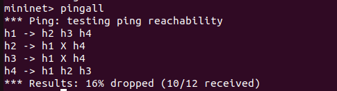
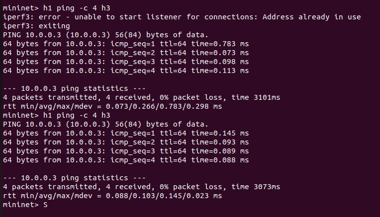
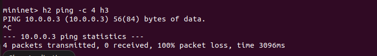
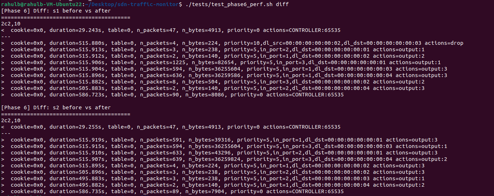
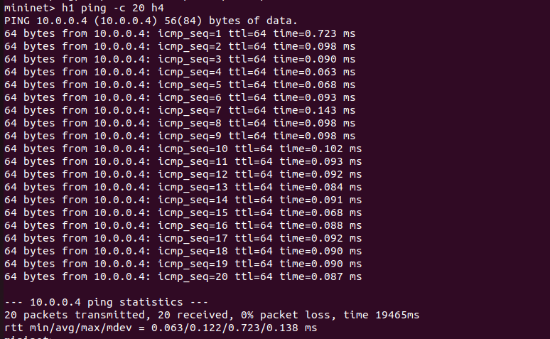
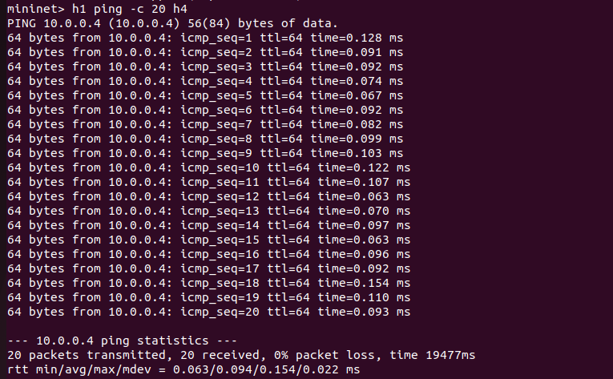
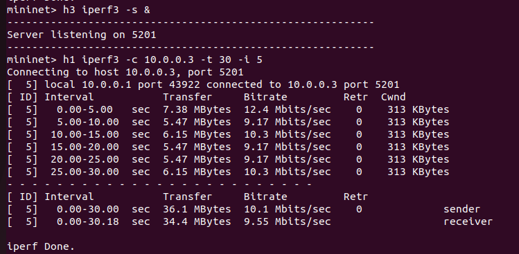
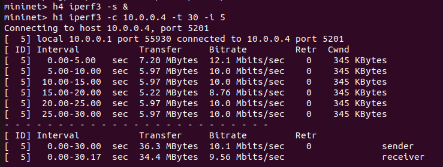
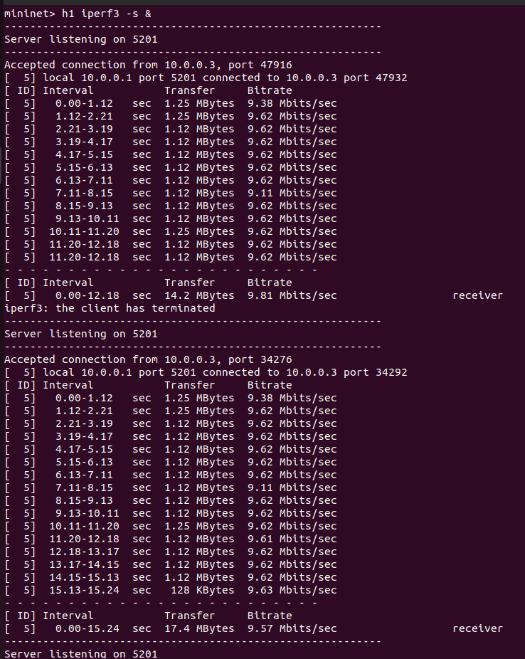
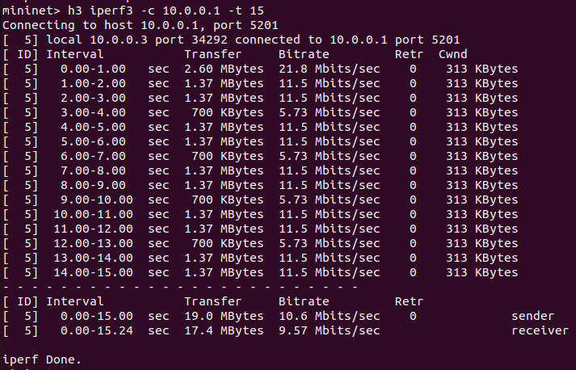

# SDN Traffic Monitoring and Statistics

**Course:** Computer Networks (UE24CS252B)
**Problem:** Orange — Controller–switch interaction, flow rule design, and network behaviour observation using Mininet + Ryu controller.

---

## 1. Problem Statement

This project implements an SDN-based traffic monitoring system that demonstrates how a centralised controller manages network switches using the OpenFlow protocol. The system:

- Deploys a custom Mininet topology with 2 OpenFlow switches and 4 hosts.
- Runs a Ryu controller application that implements **learning-switch** forwarding with **match–action flow rules**.
- Enforces **access control** by dropping traffic between a specific host pair (h2 → h3).
- Periodically **polls flow statistics** from all connected switches and logs them for analysis.
- Captures **performance metrics** (latency, throughput, flow table evolution) to demonstrate the impact of proactive flow caching.

The chosen design satisfies the problem requirements by clearly showing controller–switch interaction via OpenFlow 1.3, explicit match–action rules (forwarding at priority 5, blocking at priority 10), and periodic traffic monitoring with logged statistics.

---

## 2. Architecture

### Topology Diagram

```
                    ┌──────────────────────────────────┐
                    │       Ryu Controller (c0)        │
                    │       127.0.0.1:6633             │
                    │   ┌────────────────────────┐     │
                    │   │  TrafficMonitorApp     │     │
                    │   │  - Learning Switch     │     │
                    │   │  - Firewall (DROP)     │     │
                    │   │  - Stats Polling (10s) │     │
                    │   └────────────────────────┘     │
                    └──────────┬───────────────┬───────┘
                         OpenFlow 1.3   OpenFlow 1.3
                               │               │
    h1 (10.0.0.1)  ─┐          │               │          ┌─ h3 (10.0.0.3)
    MAC: ...:01     ├── [ s1 ] ┘               └── [ s2 ] ┤  MAC: ...:03
    h2 (10.0.0.2)  ─┘    │          10 Mbps         │     └─ h4 (10.0.0.4)
    MAC: ...:02          └──────────────────────────┘        MAC: ...:04
                                 Backbone Link
```

### How It Works

1. **Switch connects** → Controller installs a table-miss entry (priority 0) that forwards all unmatched packets to the controller.
2. **Packet arrives at switch** → If no flow rule matches, the switch sends it to the controller via `packet_in`.
3. **Controller processes** → Learns the source MAC, checks if the pair is blocked, and either installs a DROP rule (priority 10) or a forwarding rule (priority 5).
4. **Monitoring thread** → Every 10 seconds, the controller sends `OFPFlowStatsRequest` to each switch and logs the reply.

---

## 3. Setup and Execution Steps

### Prerequisites

An Ubuntu 20.04/22.04 LTS VM with at least 2 vCPUs and 2 GB RAM.

### Install Dependencies

```bash
sudo apt update && sudo apt upgrade -y
sudo apt install -y mininet iperf3 wireshark tcpdump net-tools
sudo apt install -y python3-pip
pip3 install ryu
```

### Clone the Repository

```bash
git clone https://github.com/RahulBiju-dev/sdn-traffic-monitor.git
cd sdn-traffic-monitor
```

### Run the Stack

**Terminal 1 — Start the Controller:**
```bash
ryu-manager controller/traffic_monitor.py 2>&1 | tee logs/controller.log
```

**Terminal 2 — Start the Topology:**
```bash
sudo python3 topology/topo.py
```

---

## 4. Expected Output

### Controller Terminal (Stats Report)

```
--- Stats Report --- 2026-04-18 17:05:32 | Switch: s1 ---
Match: {'in_port': 1, 'eth_dst': '00:00:00:00:00:02'} | Priority: 5 | Packets: 12 | Bytes: 1176
Match: {'in_port': 3, 'eth_dst': '00:00:00:00:00:01'} | Priority: 5 | Packets: 12 | Bytes: 1176
Match: {'eth_src': '00:00:00:00:00:02', 'eth_dst': '00:00:00:00:00:03'} | Priority: 10 | Packets: 3 | Bytes: 294
--------------------------------------------------
```

### Flow Table Dump (`ovs-ofctl`)

```
cookie=0x0, duration=45.123s, table=0, n_packets=0, n_bytes=0, priority=0 actions=CONTROLLER:65535
cookie=0x0, duration=30.456s, table=0, n_packets=12, n_bytes=1176, priority=5,in_port=1,dl_dst=00:00:00:00:00:02 actions=output:2
cookie=0x0, duration=25.789s, table=0, n_packets=3, n_bytes=294, priority=10,dl_src=00:00:00:00:00:02,dl_dst=00:00:00:00:00:03 actions=drop
```

---

## 5. Test Scenarios

### Scenario 1: Normal Traffic (Allowed Flow)

| Step | Command | Expected Result |
|------|---------|-----------------|
| 1 | `pingall` | All pairs succeed except h2 → h3 |
| 2 | `h1 iperf3 -s &` then `h3 iperf3 -c 10.0.0.1 -t 15` | ~8–10 Mbps throughput |
| 3 | `ovs-ofctl dump-flows s1` | Multiple priority=5 forwarding rules visible |



*Figure 1: Mininet `pingall` results showing connectivity between all hosts except the blocked h2-h3 pair.*


### Scenario 2: Blocked Traffic (DROP Rule)

| Step | Command | Expected Result |
|------|---------|-----------------|
| 1 | `h1 ping -c 4 h3` | 0% packet loss (allowed) |
| 2 | `h2 ping -c 4 h3` | 100% packet loss (blocked) |
| 3 | `ovs-ofctl dump-flows s1 \| grep priority=10` | DROP rule with empty actions for h2→h3 |


*Figure 2: Successful ICMP communication between h1 and h3 (Allowed).*


*Figure 3: 100% packet loss for h2 to h3 traffic (Blocked by Firewall Rule).*


---

## 6. Performance Results

| Metric | Value |
|--------|-------|
| h1 → h4 Avg RTT (1st run, cold) | 0.112 ms |
| h1 → h4 Avg RTT (2nd run, warm) | 0.094 ms |
| h1 → h4 Throughput (30s iperf) | 9.56 Mbps |
| h1 → h3 Throughput (30s iperf, cross-switch) | 9.55 Mbps |

### Latency and Throughput Analysis


*Figure 4: Latency comparison showing the benefit of flow entry caching.*

**RTT Observation:** The first ping run has higher latency because every packet triggers a `packet_in` event to the controller. The second run is faster because flow rules are already installed in the switch datapath, so packets are forwarded locally without controller involvement.


*Figure 5: High latency (Cold Start) during initial flow rule installation.*


*Figure 6: Low latency (Warm Start) after flow rule installation.*

### Throughput Performance


*Figure 7: Iperf3 throughput between h1 and h3 (Cross-Switch link).*


*Figure 8: Iperf3 throughput between h1 and h4.*


*Figure 9: Iperf3 server running on h1.*


*Figure 10: Iperf3 client running on h3 reaching h1.*


---

## 7. Screenshots and Logs

| File | Description |
|------|-------------|
| `screenshots/pingall_mn.png` | Mininet `pingall` output showing h2→h3 blocked |
| `screenshots/allowed_ping_h1_h3.png` | Successful ping from h1 to h3 (0% loss) |
| `screenshots/blocked_ping_h2_h3.png` | Blocked ping from h2 to h3 (100% loss) |
| `screenshots/h1_iperf.png` | iperf3 server output on h1 |
| `screenshots/h3_iperf.png` | iperf3 client output from h3 |
| `screenshots/throughput_h1_h3.png` | Throughput graph/log for h1 to h3 |
| `screenshots/throughput_h1_h4.png` | Throughput graph/log for h1 to h4 |
| `screenshots/latency_measurement1.png` | Cold start RTT measurement |
| `screenshots/latency_measurement2.png` | Warm start RTT measurement |
| `screenshots/performance_diff.png` | Latency improvement comparison |
| `logs/scenario1_flow_table.txt` | Flow table dump for Scenario 1 |
| `logs/scenario1_iperf.txt` | iperf text output for Scenario 1 |
| `logs/scenario2_flow_table.txt` | Flow table dump showing DROP rule |
| `logs/s1_before_traffic.txt` | s1 flow table before any traffic (Phase 6) |
| `logs/s2_before_traffic.txt` | s2 flow table before any traffic (Phase 6) |
| `logs/s1_after_traffic.txt` | s1 flow table after traffic generation (Phase 6) |
| `logs/s2_after_traffic.txt` | s2 flow table after traffic generation (Phase 6) |

---

## 8. References

1. **Ryu SDN Framework Documentation** — https://ryu.readthedocs.io/en/latest/
2. **Mininet Documentation** — http://mininet.org/walkthrough/
3. **OpenFlow 1.3 Specification** — https://opennetworking.org/wp-content/uploads/2014/10/openflow-spec-v1.3.0.pdf
4. **Open vSwitch Manual** — https://www.openvswitch.org/support/dist-docs/
5. **Ryu Learning Switch Example** — https://github.com/faucetsdn/ryu/blob/master/ryu/app/simple_switch_13.py
